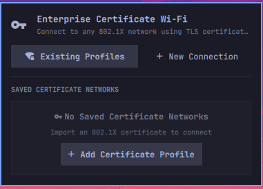

# Certificate Wi-Fi Manager for Omarchy

Universal Omarchy Quattro shell plugin for 802.1X EAP-TLS certificate-based Wi-Fi networks (including easyroam, eduroam, campus, and enterprise RADIUS networks).

<p align="center">
  
</p>

## Overview

Provides automated X.509 client certificate (`.p12` / `.pfx`) extraction, cryptographic verification, leaf certificate isolation, server domain suffix matching, and certificate expiration monitoring.

## Features

- **Universal 802.1X EAP-TLS**: Connects to certificate-based wireless networks.
- **Auto-Discovery**: Scans local download directories for `.p12`/`.pfx` bundles and detects nearby SSIDs.
- **Certificate Inspection**: Extracts identity, validity range, and domain realm before installation.
- **Credential Protection**: Passwords and private keys are piped via standard input to prevent process table exposure.
- **Cryptographic Verification**: Verifies public and private key pairs prior to profile installation.
- **Leaf Isolation**: Separates client leaf certificates (`-clcerts`) and CA chains (`-cacerts`) to avoid validation errors.
- **Server Validation**: Supports CA bundle pinning and domain suffix matching for MitM protection.
- **Validity Monitoring**: Bar widget tracks certificate expiration and indicates renewal status.
- **Backend Support**: Compatible with NetworkManager (`nmcli`) and `iwd`.

## Dependencies & Prerequisites

The plugin and backend helper script require the following system packages:

- **`jq`**: Required for JSON serialization and parsing between the QML interface and backend engine.
- **`openssl`**: Required for PKCS#12 (`.p12`/`.pfx`) decryption, leaf certificate isolation, and key verification.
- **`networkmanager`** (`nmcli`) or **`iwd`** (`iwctl`): Required for Wi-Fi network configuration and connection management.
- **`polkit` / `pkexec`** *(optional)*: Required if managing `iwd` profiles without root privileges.

On Arch Linux / Omarchy:
```bash
sudo pacman -S --needed jq openssl networkmanager
```

## Installation

### Via Git / Plugin Manager

```bash
omarchy plugin add https://github.com/grynov/omarchy-cert-wifi.git --enable
```

### Manual Installation (Development)

```bash
mkdir -p ~/.config/omarchy/plugins/io.github.grynov.cert-wifi
cp -r * ~/.config/omarchy/plugins/io.github.grynov.cert-wifi/
# Or create a symlink for live development:
# ln -s "$(pwd)" ~/.config/omarchy/plugins/io.github.grynov.cert-wifi

omarchy plugin enable io.github.grynov.cert-wifi right
omarchy-shell shell rescanPlugins
```

## Uninstallation & Cleanup

### Via Plugin Manager

```bash
omarchy plugin remove io.github.grynov.cert-wifi
omarchy-shell shell rescanPlugins
```

### Cleanup Local / Dev Installation

To completely remove a manual development installation and clean up extracted certificates and network profiles:

```bash
# 1. Disable and delete the local plugin folder
omarchy plugin disable io.github.grynov.cert-wifi
rm -rf ~/.config/omarchy/plugins/io.github.grynov.cert-wifi
omarchy-shell shell rescanPlugins

# 2. (Optional) Remove stored certificate profiles, private keys, and metadata
rm -rf ~/.local/share/cert-wifi

# 3. (Optional) Remove configured Wi-Fi connection from your network backend
nmcli connection delete "<SSID>"
# For iwd:
# sudo rm -f /var/lib/iwd/"<SSID>".8021x
```

## Backend Engine CLI

The backend engine can be run independently:

```bash
# Discover certificates and nearby SSIDs
./backend/cert-helper.sh discover

# Inspect certificate metadata
./backend/cert-helper.sh inspect --file /path/to/certificate.p12

# Install network profile
./backend/cert-helper.sh install --file cert.p12 --ssid "NetworkSSID" --domain "radius.example.com"

# List profiles and expiration dates
./backend/cert-helper.sh list

# Delete profile
./backend/cert-helper.sh delete --id NetworkSSID
```

## License

MIT License. Copyright (c) 2026 Vladyslav Grynovetskyy.
